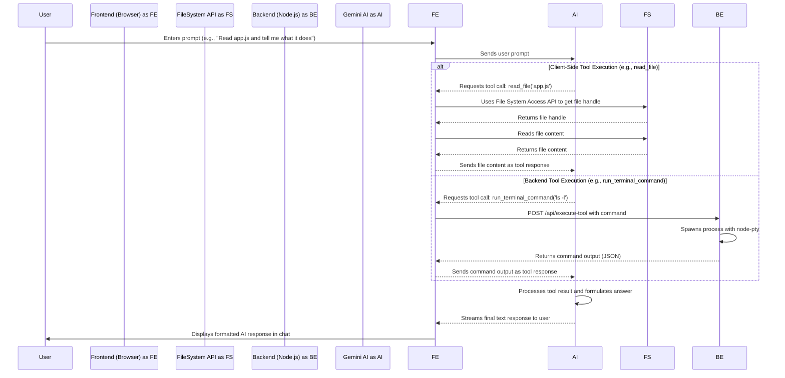

# Application Architecture

This document provides a high-level overview of the application's architecture. For a more detailed guide on the project structure, development workflow, and how to contribute, please see the **[Contributing Guide](./CONTRIBUTING.md)**.

## Core Philosophy: Client-Centric Design

The application is architected to be **secure and frontend-heavy**. The majority of the logic, including all file system interactions, the editor, and the AI agent, runs directly in the browser. A minimal backend is used only for tasks that the browser's sandbox cannot perform.

## Component Overview

*   **Frontend**: A single-page application built with vanilla JavaScript, HTML, and CSS. It uses the Monaco Editor and manages all core application logic.
*   **Backend**: A lightweight Node.js/Express server that serves static files and provides sandboxed execution for terminal commands and URL fetching.
*   **AI Agent**: The Gemini agent logic is managed entirely on the client-side in `frontend/js/gemini_chat.js`, which defines all available tools and orchestrates the interaction with the model.

## End-to-End Workflow

This diagram illustrates the primary interaction flow between the user, frontend, backend, and the Gemini AI.

## State Management

The application's state, including API keys and the handle to the open project folder, is persisted in the browser's **IndexedDB**. This allows for seamless session restoration between visits.
