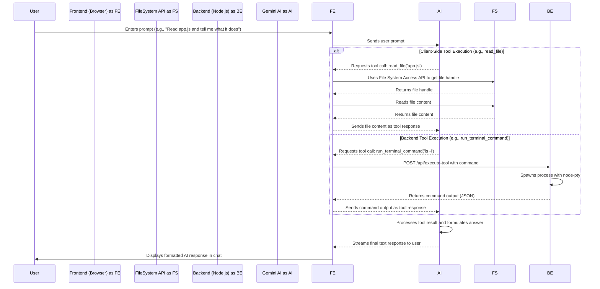

# Contributing to the AI Code Editor

Welcome, developer! This guide provides everything you need to know to get started with the AI-Powered Code Editor project. It covers the architecture, development workflow, and coding standards to help you contribute effectively.

---

## 1. Core Architecture & Philosophy

The application is designed with a **secure, client-centric architecture**.

*   **Frontend-Heavy**: The vast majority of the logic runs in the browser. This includes all file system operations (via the File System Access API), the Monaco editor, and the core AI agent logic.
*   **Minimal Backend**: A lightweight Node.js/Express server (`backend/index.js`) exists only for two reasons:
    1.  To serve the static frontend assets.
    2.  To perform actions the browser sandbox cannot, such as running terminal commands (`run_terminal_command`) or fetching external URLs (`read_url`).
*   **Stateful AI Agent**: The AI is not just a chatbot. It's a true agent that uses a predefined set of tools to interact with your project. The entire tool-calling loop is managed on the frontend in `frontend/js/gemini_chat.js`.

### End-to-End Workflow

This diagram illustrates how the components interact when the AI is given a task.

---

## 2. Project Structure

The codebase is organized into two main parts: `frontend` and `backend`.

*   **`backend/`**: Contains the Node.js server.
    *   `index.js`: The main Express server file.
    *   `package.json`: Defines backend dependencies like `express` and `node-pty`.
*   **`frontend/`**: The client-side application.
    *   `index.html`: The main entry point.
    *   `js/`: Contains all the JavaScript modules.
        *   `main.js`: Main application logic, event listeners, and initialization.
        *   `gemini_chat.js`: **(Core AI Logic)** Manages the Gemini model, tool definitions, and the entire chat/tool-calling loop.
        *   `editor.js`: Manages the Monaco editor instance, tabs, and file state.
        *   `file_system.js`: An abstraction layer for the browser's File System Access API.
        *   `ui.js`: Handles all DOM manipulation, including rendering the file tree and chat messages.
        *   `db.js`: IndexedDB manager for storing API keys and the project directory handle.
    *   `style.css`: Main styles for the application.

---

## 3. Development Setup & Workflow

Follow these steps to run the application locally.

### Prerequisites

*   [Node.js](https://nodejs.org/) (which includes `npm`).

### Installation and Running

The project includes management scripts to simplify the setup process.

1.  **Launch Management Script**:
    *   **Windows**: Double-click `app.bat`.
    *   **macOS / Linux**: Run `chmod +x ./app.sh`, then `./app.sh`.

2.  **Install Dependencies**:
    *   From the script's menu, select **[1] Install Dependencies**. This installs all `npm` packages for both the frontend and backend.

3.  **Start the Server**:
    *   From the menu, select **[2] Start Server**. This launches the application server.

4.  **Access the App**:
    *   Open a browser and go to **`http://localhost:3000`**.

---

## 4. Coding Standards

To maintain code quality and consistency, we follow these standards.

*   **Language**: Modern JavaScript (ES6+), written in a modular pattern.
*   **Formatting**: We use **Prettier** for automatic code formatting. Run `npm run format` in the `frontend` or `backend` directory to format your code.
*   **Naming Conventions**:
    *   `camelCase` for variables and functions.
    *   `PascalCase` for classes (e.g., `ApiKeyManager`).
    *   `kebab-case` for filenames (e.g., `api_manager.js`).
*   **Modularity**: Each file should have a clear and distinct responsibility. For example, all direct DOM manipulation is handled in `ui.js`, while all file system logic is in `file_system.js`. This separation of concerns is critical to the project's architecture.
